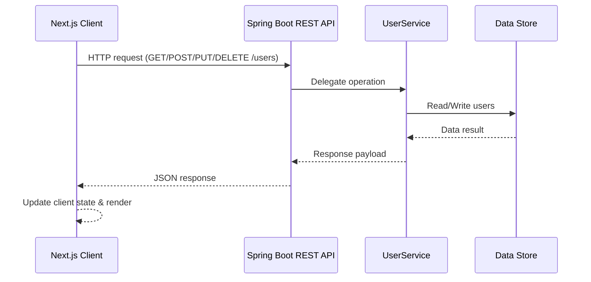

# Project Overview

This codebase adopts a decoupled architecture composed of complementary services:

| Service  | Stack                       | Purpose                                          | Default Port |
|----------|-----------------------------|--------------------------------------------------|--------------|
| Frontend | Next.js (React, TypeScript) | User interface, routing, client state management | `3000`       |
| Backend  | Spring Boot (Java 21)       | Business logic, validation, persistence, security| `8080`       |

- **Frontend:** Next.js application providing the user interface, routing, and client-side state management.
- **Backend:** Spring Boot REST API responsible for business logic, validation, persistence, and security.

During development the frontend runs on `http://localhost:3000` and communicates with the backend on `http://localhost:8080` via HTTP.

> **Architecture Snapshot:** The frontend communicates with the backend exclusively through REST endpoints. CORS and Spring Security enforce a clean boundary between presentation and domain logic.

## Quick Start Guide

1. **Clone and enter the repository**

   ```bash
   git clone https://github.com/maydaythecoder/NextJS-Spring-Boot
   cd NextJS-Spring-Boot
   ```

2. **Install dependencies**

   ```bash
   ./backend/mvnw dependency:resolve
   (cd frontend && npm install)
   ```

3. **Prepare environment files**

   ```bash
   cp backend/env.example backend/.env.local
   cp frontend/env.example frontend/.env.local
   ```

   Adjust the copied files if you need non-default ports or database credentials.
4. **Launch both services**

   ```bash
   chmod +x run.sh
   ./run.sh
   ```

5. **Verify endpoints**
   - Frontend: `http://localhost:3000`
   - API: `http://localhost:8080/users`

## File & Folder Structure

``` txt
.
├── backend/
│   ├── mvnw, mvnw.cmd
│   ├── pom.xml
│   └── src/
│       ├── main/
│       │   ├── java/com/example/tutorial/
│       │   │   ├── TutorialApplication.java
│       │   │   ├── api/UserController.java
│       │   │   ├── config/{CorsConfig.java, SecurityConfig.java}
│       │   │   ├── model/User.java
│       │   │   └── service/UserService.java
│       │   └── resources/application.properties
│       └── test/java/com/example/tutorial/TutorialApplicationTests.java
├── frontend/
│   ├── package.json, package-lock.json
│   ├── next.config.ts
│   ├── src/
│   │   ├── app/
│   │   │   ├── layout.tsx
│   │   │   ├── page.tsx
│   │   │   └── users/{page.tsx,[id]/page.tsx,new/page.tsx,...}
│   │   ├── components/{common/,users/}
│   │   ├── lib/{api/,hooks/,state/,types/}
│   │   └── app/globals.css
│   └── tsconfig.json
├── run.sh
└── .gitignore
```

### Backend Highlights

- `TutorialApplication.java`: Spring Boot entry point.
- `api/UserController.java`: Defines CRUD endpoints for `/users`.
- `service/UserService.java`: In-memory user store and business logic.
- `config/CorsConfig.java`: Configures CORS to allow the frontend origin.
- `config/SecurityConfig.java`: Spring Security filter chain configuration.

### Frontend Highlights

- `layout.tsx`: Global layout with shared navigation and fonts.
- `users/`: App Router segments for listing users, viewing details, and creating records.
- `components/common/`: Reusable UI primitives (navbar, error states, etc.).
- `components/users/`: User-specific cards, skeletons, and forms.
- `lib/api/`: Fetch utilities encapsulating backend interaction.
- `lib/hooks/`: Custom React hooks for form state and API integration.

## Application Logic

### API Integration

- Frontend components call the backend via `fetch` wrappers defined in `src/lib/api/users.ts`.
- Hooks (for example `useCreateUserForm`) encapsulate mutation flows and local state updates.
- The backend exposes REST endpoints for retrieving, creating, updating, and deleting users.

### Authentication & Authorization

- Spring Security disables form login and HTTP Basic, exposing open endpoints for now.
- The security filter chain is ready for future authentication mechanisms (JWT, OAuth2, session-based).
- CORS configuration restricts requests to the known frontend origin.

### Validation

- Backend controllers can leverage Spring validation annotations to enforce input requirements.
- Frontend forms perform basic client-side validation prior to submitting requests.

## Data Flow



1. User interacts with the Next.js UI (e.g., visiting `/users` or submitting the creation form).
2. Frontend hook issues an HTTP request to the Spring Boot API (`GET/POST/PUT/DELETE /users`).
3. Controller delegates to `UserService`, which manages the in-memory store (or database when extended).
4. Service returns results to the controller, which serializes them as JSON responses.
5. Frontend receives the JSON payload and updates component state to render the latest data.

## Security

- **CORS:** Allows requests only from `http://localhost:3000` during development.
- **CSRF:** Disabled to simplify API usage; add token-based safeguards when introducing browser sessions.
- **Headers:** Frame options relaxed exclusively for the H2 console; other default headers remain intact.
- **Future Authentication:** Security configuration is structured to plug in real authentication and role-based rules.
- **Validation:** Extend service/controller layers to enforce strict input validation and sanitize logs.

## Setup Instructions

### Prerequisites

- Node.js 20+
- npm 10+
- Java 21+
- Maven Wrapper (bundled) or Maven 3.9+

### Install Dependencies

```bash
# Backend
cd backend
./mvnw dependency:resolve

# Frontend
cd ../frontend
npm install
```

## Environment Setup

Create the following environment files before running the application. Sample templates are provided at `backend/env.example` and `frontend/env.example`.

```bash
cp backend/env.example backend/.env.local    # adjust values as needed
cp frontend/env.example frontend/.env.local  # consumed by Next.js
```

### Backend (`backend/src/main/resources/application.properties`)

```properties
spring.application.name=tutorial
server.port=8080

spring.h2.console.enabled=true
spring.h2.console.path=/h2-console

# Example external database configuration (uncomment and adjust as needed)
# spring.datasource.url=jdbc:postgresql://localhost:5432/app
# spring.datasource.username=app_user
# spring.datasource.password=changeMe
```

### Frontend (`frontend/.env.local`)

```env
NEXT_PUBLIC_API_BASE_URL=http://localhost:8080
```

## Running the App

### Option 1: Manual terminals

```bash
# Terminal 1 - backend
cd backend
./mvnw spring-boot:run

# Terminal 2 - frontend
cd frontend
npm run dev
```

Access the UI at `http://localhost:3000`; the API listens on `http://localhost:8080`.

### Option 2: Combined script

```bash
chmod +x run.sh
./run.sh
```

The script launches both services and traps `SIGINT` to terminate them cleanly.

## Additional Notes

- Update `NEXT_PUBLIC_API_BASE_URL` for staging/production deployments.
- Replace the in-memory `UserService` with a persistent repository layer before production.
- Extend `SecurityConfig` with concrete authentication and authorization rules as the product evolves.
